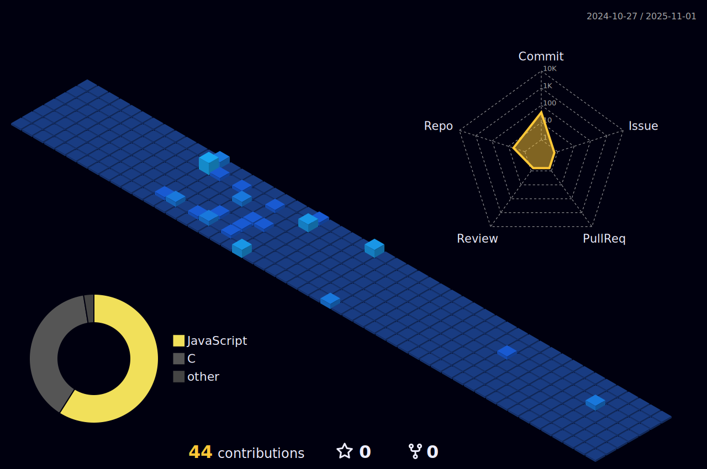

<!--horizontal divider(gradiant)-->

<h2 align="center">Hi 👋, I'm Nikunj Ganvit</h2>

 

   

 

<!--horizontal divider(gradiant)-->

## 👨‍💻 About Me 

I am computer Engineering Student at DDU, Nadiad.

### 📚 Education
- **Degree**: B.Tech in Computer Engineering
- **Institution**: DDU, Nadiad
- **Year**: 2nd Year

### 🌱 Learning Goals
- Create new projects to enhance my web development skills.
- Improve problem-solving skills through regular practice of DSA.
- Explore new frameworks and tools in the full-stack development space.

### 📫 How to Reach Me
- **Email**: [nikunjganvit223@gmail.com](mailto:nikunjganvit223@gmail.com)
- **LinkedIn**: [Nikunj Ganvit](https://www.linkedin.com/in/ganvit-nikunj-78b9a8250/)
- **GitHub**: [Nikunj Ganvit](https://github.com/NikunjGanvit)

<!--horizontal divider(gradiant)-->

## My Stats 

 

 

  
📈 More Stats

   
 

 <a href="https://github.com/nikunjganvit"> 
   

  
  
 </a>
<a href="https://github.com/walidbosso"> 
   
  </a>
  
    
  
 

  
 

 

<!--horizontal divider(gradiant)-->

<h3 align="left">Languages and Tools:</h3>

             
 

<!--horizontal divider(gradiant)-->

<h3 align="left">Connect with me:</h3>

